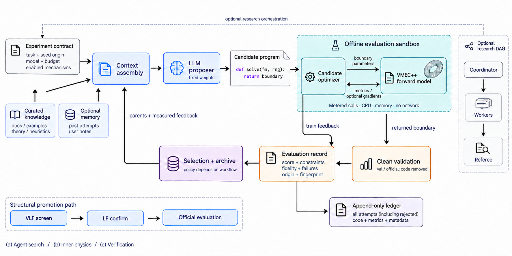
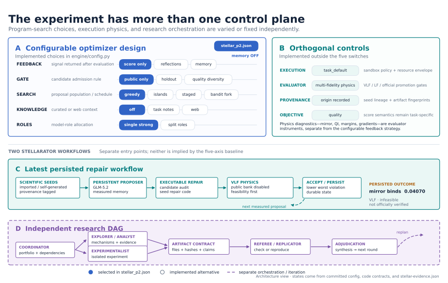
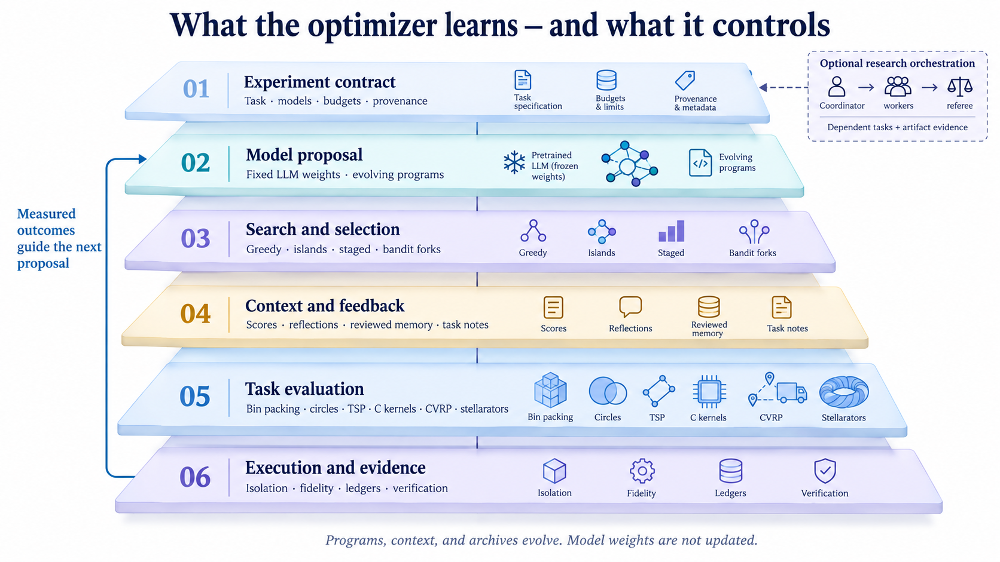
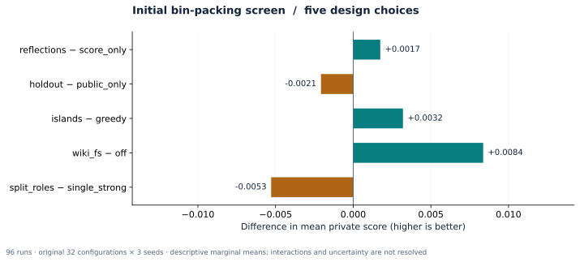
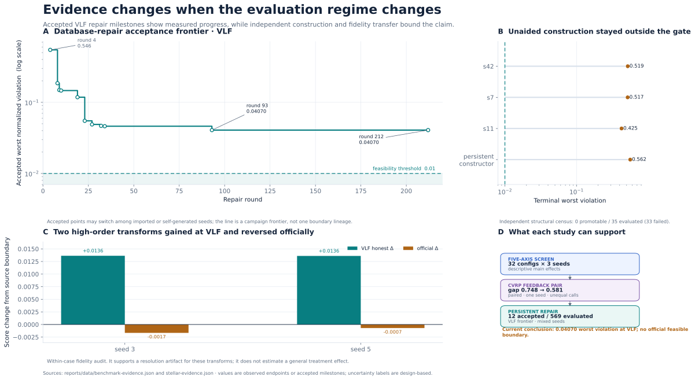
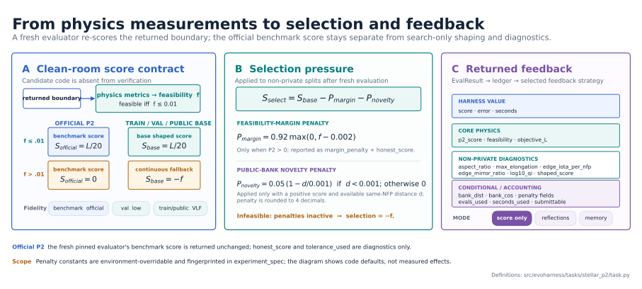
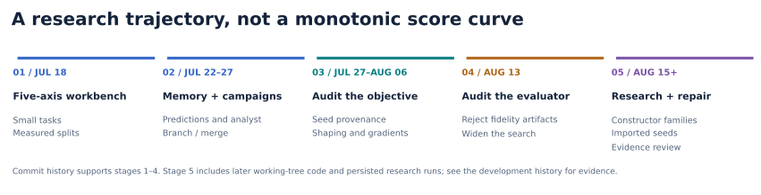

# EvoHarness


[Architecture](#architecture) · [Stellarators](#stellarator-evidence-in-depth) · [Benchmarks](#evidence-from-the-algorithmic-tasks) · [Run an experiment](#install-and-inspect) · [Evidence explorer](reports/index.html)

**A research workbench for agents that create executable solutions, learn from evaluator feedback, and search for useful novelty.**

EvoHarness studies the optimizer around a model: representation, feedback, memory, selection, search, model roles, execution isolation, fidelity, and verification. An agent proposes an artifact, a task-owned evaluator measures it, and the harness records enough evidence to decide what to try next. Six task contracts range from small algorithmic benchmarks to constrained stellarator design.

This is active research. The objective is technically substantive, independently verified new solutions. The record includes successful local optimization, negative results, fidelity artifacts, inherited refinements, and approaches that remain unproven. In this README, **implemented** describes code, **observed** describes a recorded run, **supported** requires an appropriate comparison, and **open** marks a hypothesis. A stronger score alone establishes neither independence nor scientific novelty.



*Outer loop: models propose programs using retained evidence. Inner loop: the candidate optimizer queries VMEC++ under solver and execution budgets. Training feedback can drive selection immediately; clean validation re-scores the returned boundary without candidate code. Optional research orchestration and structural fidelity promotion are separate controls.*

The system illustration uses the compact control-loop grammar of [AlphaEvolve, Figures 1–2](https://arxiv.org/pdf/2506.13131) and the separation of generation from evaluation in [KernelBench, Figure 1](https://arxiv.org/pdf/2502.10517). It depicts EvoHarness's implementation, not either reference system. AI-generated illustrations are conceptual; the plots and numeric tables below come from recorded evidence. [Prompts and visual provenance](reports/data/visual-provenance.json) are retained.

The [offline evidence explorer](reports/index.html) is the fastest way to inspect the reviewed run inventory. It is generated from local ledgers and opens in a browser without an application server. Raw candidate conversations, run state, downloaded data, external checkouts, and mutable memory stay under `.local/` and are intentionally untracked.

## Current research state

EvoHarness now has two related but distinct centers of gravity:

1. The **configurable evolutionary optimizer** compares choices inside a reusable propose–evaluate–select loop across six tasks.
2. The **stellarator research system** runs persistent repair, independent construction, mechanism discovery, polishing, and verification workflows around a pinned ConStellaration/VMEC++ evaluator.

The latest persisted stellarator direction is feasibility repair of declared research seeds, including published scientific configurations. It disables the public leaderboard bank, but its imported seeds retain their ancestry. It must not be described as either public-bank refinement or unaided construction.

| Evidence | Result | What it establishes |
|---|---:|---|
| Latest repair frontier | Worst normalized VLF violation **0.0407015**, against the **0.01** feasibility limit; `L = 3.5815`; P2 **0** | The cleanest repair landmark in the record, still infeasible and not officially verified |
| Highest raw legacy score | Official P2 **0.6420577**, feasibility `0.0097398` | A legal public-seed refinement that used 97.4% of the tolerance and remained almost collinear with its ancestor (`bank_cos = 0.999998`) |
| Low-margin inherited ceiling | Official P2 **0.6344215**, feasibility `0.0019244` | A more defensible view of inherited boundary quality away from the feasibility cliff |
| Pinned-solver local polish | **+0.001956** official score over 17 steps and 715 solves | A local improvement transferred from VLF to official fidelity; no new basin was demonstrated |
| High-order structural transforms | About **+0.0136** VLF, reversing to `-0.001663` and `-0.000706` officially | Coarse screening rewarded a solver-resolution artifact; promotion changed the conclusion |

The persisted repair run reached round 694 after 569 evaluated proposals, 123 evaluation failures, and 12 acceptances, then exhausted a cumulative 3,000-call budget at call 3,001. Later supervision activity is not evidence of a better boundary. The seed factory reached round 2,421, with 8,569 recipe attempts and 2,650 measured; 5,520 missing-image errors in its state are historical events, not evidence that the evaluator image is currently absent. Its state still read round 2,421 on 2026-09-21. The 8,924 inventory rows added after the 2026-09-17 review were factory `llm_error` events, not new physical results. The scientific values in this README therefore describe the **2026-09-17** evidence review, with operational state and inventory rechecked on **2026-09-21**.

## Install and inspect

EvoHarness uses Python 3.11+ and [`uv`](https://docs.astral.sh/uv/):

```bash
uv sync --group dev --group analysis
uv run evoharness doctor
uv run evoharness tasks
uv run evoharness axes
```

`doctor` reports optional runtime dependencies separately, so a lightweight benchmark installation does not pretend to be ready for VMEC-backed physics. Copy `.env.example` to `.env` and set the provider key required by the selected model before a paid model run. A zero-model-call or seed-only configuration needs no provider key.

Each task has a checked configuration in [`configs/`](configs/):

```bash
uv run evoharness run --config configs/binpacking.json
uv run evoharness run --config configs/circles.json
uv run evoharness run --config configs/tsp.json
uv run evoharness run --config configs/matmul_c.json
uv run evoharness run --config configs/cvrp.json
uv run evoharness run --config configs/stellar_p2.json
```

Download benchmark data explicitly and keep it local:

```bash
uv run evoharness fetch tsp
uv run evoharness fetch cvrp
```

Fetched instances are stored in `.local/data/tsp/` and `.local/data/cvrp/`; they are not bundled into the package or application image.

The local application and evidence tools use the same package entry point:

```bash
uv run evoharness serve
uv run evoharness report --help
uv run evoharness screen --help
uv run evoharness inventory
uv run evoharness figures
```

The root `Dockerfile` and `compose.yml` are an optional lightweight UI/runtime deployment. They deliberately do not mount the host Docker socket. Run CVRP, stellarator, and `require_container` experiments from the host CLI with Docker daemon access unless an operator has explicitly provided an external container-execution service. The generic evaluator image is built lazily on first use, before a model call; it can also be prepared directly:

```bash
docker build -t evoharness-benchmark-eval \
  -f src/evoharness/execution/Dockerfile.eval \
  src/evoharness/execution
```

The command reference is available through `uv run evoharness --help` and each subcommand's `--help`. Run directories are created below `.local/runs/`; a run's append-only ledger, effective config, fingerprints, candidates, and final artifacts form its evidence packet.

### Activating memory and other axes



*Blue selections come from `configs/stellar_p2.json`. The persistent repair workflow and research DAG have separate entry points and state. The figure is regenerated from the committed configuration and reviewed evidence.*

The committed JSON files are readable experiment specifications, not hidden defaults. Copy a config for an experimental arm and override only the declared axis being studied. For example, activate reviewed memory with `feedback=memory` and select curated task notes with `knowledge=task_notes`:

```bash
uv run evoharness run --help
uv run evoharness run --config configs/binpacking.json \
  --set switches.feedback=memory \
  --set switches.knowledge=task_notes \
  --dry-run
```

Remove `--dry-run` after inspecting the resolved config. `knowledge_mode=inject` places selected notes directly in the prompt; `knowledge_mode=tool` makes them available through bounded reads. Generated reviewed memory always lives under `.local/memory/<task>/`. Use separate snapshots for controlled comparisons; a shared evolving memory can transfer useful failures, but it also contaminates an ablation and can preserve stale diagnoses. Fixed, curated task knowledge belongs in `src/evoharness/tasks/<task>/resources/knowledge.json`; model-facing task instructions belong in `resources/*.txt`. Neither is generated memory.

The current five configurable axes have a raw Cartesian product of 216 combinations. Because `knowledge=web` requires `feedback=memory`, **168 configurations are valid**. The original study used two values per axis, hence its historical **2⁵ = 32** configurations.

| Axis | Values | Experimental meaning |
|---|---|---|
| `feedback` | `score_only`, `reflections`, `memory` | Scalar feedback; verbal comparison; or durable task memory maintained from evidence |
| `gate` | `public_only`, `holdout`, `quality_diversity` | Train-score admission; validation-backed admission; or a quality/diversity frontier |
| `search` | `greedy`, `islands`, `staged`, `bandit_fork` | One lineage; migrating niches; forced redesign after stalls; or bandit-directed branching |
| `knowledge` | `off`, `task_notes`, `web` | No retrieval; curated local task knowledge; or sourced research delivered through memory |
| `roles` | `single_strong`, `split_roles` | One stronger writer/reviewer model; or cheaper generation with stronger critique |

Compile/parse repair, resume, branch merge, analyst and refiner roles, campaign orchestration, fidelity promotion, and memory isolation are independent controls. They must be recorded in the effective config rather than presented as additional orthogonal axes.

Execution is also a design axis even though it is not one of the five screening switches. Each task selects its appropriate backend by default. Python and C artifacts run with time and resource limits in temporary subprocesses; task-specific Docker evaluators add network removal, capability dropping, memory/CPU caps, and reproducible dependencies. Set `execution=require_container` when an experiment must fail closed if it cannot be containerized. The ordinary subprocess fallback uses rlimits, a timeout, a temporary directory, and network namespace isolation when available. It is suitable for cooperative research code, not hostile multi-tenant execution. CVRP results are validated and repriced by host code. Stellarator boundaries are re-scored in a fresh evaluator container after candidate code has been removed.

```bash
uv run evoharness run --config configs/binpacking.json \
  --execution require_container \
  --dry-run
```

## Tasks and score contracts

Task IDs and package directories are stable: `binpacking`, `circles`, `tsp`, `matmul_c`, `cvrp`, and `stellar_p2`.

| Task | Evolved artifact | Maximized score | Evidence boundary |
|---|---|---|---|
| [`binpacking`](src/evoharness/tasks/binpacking/) | Online priority function | Negative mean fractional excess over the L1 lower bound | Generated train/private instances; many different formulas are behaviorally identical under `argmax` |
| [`circles`](src/evoharness/tasks/circles/) | Complete valid 26-circle construction | Sum of radii | Evaluator checks containment and overlap |
| [`tsp`](src/evoharness/tasks/tsp/) | Tour constructor followed by fixed 2-opt | Negative mean percent gap | TSPLIB private optima; generated splits use the fixed baseline as reference |
| [`matmul_c`](src/evoharness/tasks/matmul_c/) | Compiled C matrix-multiplication kernel | Geometric-mean speedup | Correctness against the naive result; candidate and baseline timed in the same binary |
| [`cvrp`](src/evoharness/tasks/cvrp/) | Python policy with optional compiled C local search | Negative mean percent gap to BKS | Host validates routes, capacity, customer coverage, deadlines, and distance |
| [`stellar_p2`](src/evoharness/tasks/stellar_p2/) | Python `solve(fm, rng)` optimizer returning a Fourier boundary | `objective_L / 20` only when every official normalized violation is at most `0.01` | Metered inner solver; clean returned-boundary re-score in the pinned physics image |

Scores use different units and must not be pooled. For human-scale plots, use excess percent for bin packing, gap percent for TSP/CVRP, sum of radii for circles, speedup for `matmul_c`, and the fidelity-qualified P2 tuple for stellarators.

## Architecture



*Functional layers, not a sequence of neural-network training operations. The model weights stay fixed; programs, context, and archives change between trials. Each experiment enables only its declared mechanisms.*

The installable package separates reusable mechanisms from task science:

```text
src/evoharness/
├── engine/        run lifecycle, budgets, ledgers, configs, experiment fingerprints
├── strategies/    feedback, gates, search, knowledge, memory, and model roles
├── execution/     Python/C subprocesses, Docker evaluators, limits, and isolation
├── research/      hypothesis portfolios, evidence contracts, orchestration, and handoffs
├── tasks/         six evaluator-owned task packages and immutable resources
│   └── stellar_p2/
│       ├── discovery/   constructors and structural search
│       ├── physics/     score, gradients, fidelity, and evaluator integration
│       ├── workflows/   repair, discovery, factory, polish, and verification
│       └── proposals/   optional proposal mechanisms and converters
├── app/           local API, event stream, and UI
├── cli.py         unified command-line entry point
└── analysis/      run inventory, screening summaries, reports, and figures
```

The main source boundaries are the [run engine](src/evoharness/engine/loop.py), [configuration contract](src/evoharness/engine/config.py), [strategies](src/evoharness/strategies/), [execution policy](src/evoharness/execution/policy.py), [sandbox implementation](src/evoharness/execution/sandbox.py), [research store](src/evoharness/research/store.py), [task implementations](src/evoharness/tasks/), [CLI](src/evoharness/cli.py), and [analysis package](src/evoharness/analysis/). Stellarator-specific work is split among [discovery](src/evoharness/tasks/stellar_p2/discovery/), [physics](src/evoharness/tasks/stellar_p2/physics/), [workflows](src/evoharness/tasks/stellar_p2/workflows/), and optional [proposals](src/evoharness/tasks/stellar_p2/proposals/).

A regular run starts from a task seed, asks a model for a complete replacement, executes it under the task's policy, evaluates train and optional validation splits, applies the selected gate and search policy, then records every decision. An experiment fingerprint captures configuration, source state, task inputs, evaluator settings, and memory identity. Budget checks happen between expensive operations, so an in-flight model call or evaluation can cross a nominal time or spend ceiling before the next check.

Stellar P2 adds a second optimization level. The model writes an optimizer program; that program spends a metered inner VMEC budget to construct a boundary. The returned boundary is then re-scored without candidate code. This protects the score boundary, but same-stack re-scoring is not independent-solver validation or external replication.

Research orchestration sits above runs. A coordinator can register hypotheses, predictions, dependent worker tasks, evidence paths, referee checks, and synthesis. It is an epistemic control plane rather than an evaluator: worker reports remain untrusted until their referenced artifacts and hashes validate. The historical DAG campaign and the newer research portfolio are campaign policies, not mandatory stages of every evolution run.

### Stellarator commands and evaluator

The stellarator CLI names the distinct claim each workflow can support:

```bash
uv run evoharness stellarator repair --help
uv run evoharness stellarator discover --help
uv run evoharness stellarator research --help
uv run evoharness stellarator evaluate --help
uv run evoharness stellarator factory --help
uv run evoharness stellarator polish --help
uv run evoharness stellarator export --help
```

`repair` accepts declared, provenance-tagged scientific seeds and minimizes constraint violation before performance. `discover` uses independent constructors with public-bank blackout. `research` manages hypotheses and artifact-backed adjudication. `evaluate` re-scores a saved artifact without proposal code. `factory` searches constructor recipes. `polish` performs trusted local improvement. `export` packages a checked artifact with its lineage and evaluator metadata.

Prepare the solver image on a Docker-capable host:

```bash
docker build -t evoharness-stellar-eval \
  -f src/evoharness/tasks/stellar_p2/Dockerfile.eval \
  src/evoharness/tasks/stellar_p2
```

To inspect the latest repair design using the preserved local seed database, create a separate run directory and print its prompt without a model call:

```bash
uv run evoharness stellarator repair \
  --run-dir .local/runs/repair-next \
  --seed-dir .local/runs/repair-seeds \
  --rounds 10 --max-calls 50 --max-usd 2 --walltime-hours 1 \
  --print-prompt
```

The seed database is local research data; a fresh clone must supply its own provenance-tagged boundary JSONs through `--seed-dir`. Remove `--print-prompt` to execute that bounded experiment. Reusing a run directory resumes its persisted state and cumulative call/spend accounting. Seed-manifest or evaluator-fingerprint changes fail validation; use a new run directory for a changed experimental contract. The prior automated restarter and seed factory were paused during this migration; no paid campaign was restarted.

For the independent construction arm, use `stellarator discover` with the same run/budget flags and a distinct run directory. For a coordinator/worker experiment, choose the backend allocation explicitly:

```bash
uv run evoharness stellarator research \
  --run-dir .local/runs/research-next \
  --coordinator zai --disable-backends claude,codex \
  --tasks 4 --workers 2 --rounds 1 --total-budget-usd 2
```

The Z.ai backend reasons over supplied evidence and has no repository shell tools. Claude/Codex backends can inspect the repository and optionally use isolated worktrees; their installed CLI authentication is separate from `ZAI_API_KEY`. `--plan-only` still calls the coordinator and is **not** a free dry run. This portfolio executor is separate from the writer/refiner/analyst roles inside `run`.

| Additional control | Activation in `run --set ...` | Scope |
|---|---|---|
| Writer and cheaper model | `models.strong=MODEL`, `models.cheap=MODEL` | Model identities behind the selected role policy |
| Refinement | `refiner=MODEL`, `refiner_every=5` | Periodic synthesis of the recent candidate window |
| Independent analyst | `analyst=MODEL`, `analyst_every=10` | Evidence review and proposed directions |
| Analyst research/injection | `analyst_web=true`, `analyst_inject=1` | Web tools and bounded candidate proposals, still evaluated and gated |
| Memory review cadence | `review_every=20` | Reviewer updates to generated task memory |
| Continue or combine lineages | `resume_from=RUN_ID`, `merge_from=RUN_ID` | Resume an accepted artifact or show a second parent |
| Terminate stalled branch | `stall_stop=20` | Stop after consecutive candidates without a new best |
| Separate runtime and memory | `EVOHARNESS_HOME=/path/to/arm` before the command | Independent data/run/memory root for an experimental arm |

The authoritative environment pins ConStellaration 0.2.6 and VMEC++ 0.4.11. VMEC++ arrives through ConStellaration. Use `doctor` to check that the evaluator image is available before a campaign. Evaluator settings, image identity, thread policy, seed origin, bank access, and fidelity must stay fixed within a comparison. `STELLAR_NO_BANK=1` must be active before task import for independent work; a bank-enabled descendant must be labelled as a refinement.

<details>
<summary><strong>VMEC feedback and evaluator controls</strong></summary>

Set these environment variables before starting the process; task import captures the bank, shaping, and inner-budget settings. `ExperimentSpec` records their effective values.

| Control | Setting | Effect |
|---|---|---|
| Public seed bank | `STELLAR_NO_BANK=1` | Disables public-bank access; imported scientific seeds still retain their provenance |
| Inner optimizer budget | `STELLAR_TRAIN_OVERRIDES='{"max_evals":160,"cpu_budget":480.0,"eval_timeout":180.0}'` | Sets candidate solver-call and time limits, separate from outer model budgets |
| Boundary-only feedback | `STELLAR_MARGIN_GRAD=1` (default) | Exposes analytic aspect/margin tools; `0` removes the tools and their prompt description |
| Solver metric gradients | `STELLAR_FULL_GRAD=1` (default `0`) | Ships the pinned finite-difference/JAX gradient service into the evaluator |
| Solver execution path | `STELLAR_HOT_RESTART=0` | Disables the training fast path; the default mode is `single_stage`, not reuse of a previous equilibrium |
| Nonconvergence feedback | `STELLAR_SOFT_FAIL=0` | Removes graded residual penalties; useful as a matched control arm |
| Feasibility-margin shaping | `STELLAR_MARGIN='{"target":0.002,"slope":0.92}'` | Penalizes tolerance consumption during selection |
| Novelty shaping | `STELLAR_NOVELTY='{"min":0.003,"pen":0.05}'` | Applies the configured bank-distance shaping policy; does not certify independence |
| Container memory | `STELLAR_MEM_MB=4096` | Bounds candidate container memory; full-gradient experiments may require a larger explicit limit |

For example, compare `STELLAR_FULL_GRAD=0` and `1` using the same config, seed origin, memory snapshot, budgets, and official verification. Enabling a gradient tool changes the available information; it does not demonstrate useful tool adoption or better search. The persistent repair/discovery workflows set their inner budgets from their own CLI flags.

</details>

## Evidence from the algorithmic tasks



*Balanced marginal means from 32 configurations × three seeds. Effects are specific to this task, budget, and experiment; the detailed findings below explain the ties and confounders.*

<details>
<summary><strong>Bin packing: replicated factorial and later mechanism probes</strong></summary>

The cleanest optimizer comparison is the original 96-run factorial: 32 binary configurations × three seeds, capped at 20 model calls per run. Mean private-score main effects (`option B − option A`) were:

| Axis change | A mean | B mean | Delta |
|---|---:|---:|---:|
| score-only → reflections | -0.0403 | -0.0386 | **+0.00174193** |
| public-only → holdout | -0.0384 | -0.0405 | **-0.00207719** |
| greedy → islands | -0.0411 | -0.0379 | **+0.00320359** |
| knowledge off → task wiki | -0.0437 | -0.0353 | **+0.00836853** |
| one strong model → split roles | -0.0368 | -0.0421 | **-0.00528355** |

These are balanced descriptive marginal means, not confidence-bounded causal effects. Of the 48 task-wiki runs, 43 ended exactly at the seed's private score (`-0.03483224`), so the positive mean does not show reliable improvement. Private endpoints ranged from `-0.18218` to `-0.01148`; costs were $0.02–$0.09 per run.

A separate 60-call trajectory spent $0.1492, moved train excess from 4.590% to 1.829%, and selected a candidate with 1.379% private excess. Compared with a separate best-fit measurement of 3.483%, that is a 60.4% reduction, but the different configurations and budgets make it a capability comparison rather than an ablation.

In the later one-seed gate/search probe, quality diversity reduced private excess from 1.575% to 1.037% under staged search and from 2.370% to 0.959% under bandit-fork. It justified more testing; one seed cannot rank the policies generally.

The main failure mode was behavioral equivalence: elaborate formulas often preserved the same ordering as best-fit. Strict gates then froze on ties. This motivated behavioral novelty, tie acceptance, newest-on-tie selection, and explicit tie feedback.

</details>

<details>
<summary><strong>Circle packing, TSP, and C matrix multiplication</strong></summary>

**Circle packing.** The deterministic 26-circle evaluator and seed are preserved, but no historical optimization ledger is. The grid seed has radius `0.5 / 6 - 1e-4` per circle, sum `2.1640667`, about 82.1% of the evaluator's approximate `2.635` reference. This is evaluator-only evidence.

**TSP.** The original screen contains 96 ledgers: 95 finite private endpoints and one `-Infinity` failure sentinel. Excluding the sentinel, scores range from `-11.50545` to `-0.85684`, with mean `-4.56241`. Task knowledge had a descriptive `+1.16673` effect and islands `-0.98778`, the opposite search direction from bin packing. The exclusion breaks factorial balance, and 24 runs hit the 900-second limit after 7–19 calls while 72 reached 20 calls. These are diagnostics, not treatment estimates.

The later one-seed 2×2 showed a crossover: holdout/staged `-4.93639`, holdout/bandit-fork `-0.80563`, quality-diversity/staged `-0.83348`, and quality-diversity/bandit-fork `-3.31741`. Each search policy won under a different gate, with unequal stopping reasons.

**C matrix multiplication.** One preserved 20-call run moved from a `0.9886×` train seed to `15.0891×` train and `16.0605×` private on sizes 128/512, for $0.143. Correctness required `max_abs_diff <= 1e-7*n`. The normalization reduces host-load confounding because the naive kernel and candidate run in the same binary. It is not a BLAS comparison, portable throughput claim, or success-rate estimate.

</details>

<details>
<summary><strong>CVRP: useful memory case, noisy measurement</strong></summary>

The closest documented comparison used seed 3, the same resumed ancestor, holdout gate, staged search, no web knowledge, one strong writer, and a $4 cap:

| Feedback | Best candidate | Private gap | Calls | Elapsed |
|---|---|---:|---:|---:|
| score-only | `c0033r1` | 0.748% | 96 | 8,405 s |
| shared memory | `c0035` | **0.581%** | 165 | 5,951 s |

The 0.167 percentage-point difference is 22.3% relative. It is a single-seed case study, and the arms differ in reviewer calls, elapsed time, and shared-memory maturity. It shows that the memory arm reused earlier failures and ended better; it does not isolate the effect of memory.

The winning family kept the proven C LNS kernel and added cheap, strictly improving Python Or-opt polish. Large Python overlays, C-kernel rewrites, budget slicing, multi-start, broad KNN changes, and persistent single C calls repeatedly crashed, tied, or starved the seed kernel.

Measurement noise materially affected selection. Semantically identical code moved from `-0.0906` to `-0.0072` on train and `-0.0236` to `-0.1602` on validation; repeated private measurements spanned 0.10–0.18 gap points. This led to near-tie re-evaluation, medians, and a validation split organized by customers per route (`n/k`) rather than instance size alone. Longitudinal CVRP endpoints cannot be pooled because the evaluator, splits, memory, noise controls, and run stages changed.

</details>

Aggregate tables used by the README and figures live in [`reports/data/`](reports/data/). The underlying local ledgers remain under `.local/runs/`; generated aggregates are navigation aids, while ledgers and evaluator artifacts are the source evidence.

## Stellarator evidence in depth



*Each panel retains its own experiment and score semantics. Accepted repair landmarks are selected observations, not a complete learning curve; imported seeds and unaided constructors are separate provenance classes. [Vector PDF](reports/figures/evaluation-trajectory.pdf) · [Plot data](reports/data/design-view.json).*

<details open>
<summary><strong>Score semantics and provenance</strong></summary>



*Code-level definitions, not measured effect sizes. Official scoring, selection pressure, and feedback content remain distinct. [Vector PDF](reports/figures/reward-feedback.pdf).*

At official fidelity, the boundary receives `objective_L / 20` only when all five normalized violations are at most `0.01`; otherwise P2 is zero. During search, infeasible boundaries receive the negative worst violation to provide a slope below the feasibility wall. Later campaigns added:

```text
honest_score = p2_score - 0.92 × max(0, feasibility - 0.002)
```

This exposes score bought by walking toward the official tolerance. It is a shaping diagnostic, not a replacement benchmark. Novelty uses both scale/gauge-normalized coefficient distance and cosine similarity to the public seed bank. A boundary can clear a `1e-3` export guard and still have cosine `0.99999+` to its ancestor.

The repository therefore contains several legitimate “best” values answering different questions:

| Claim | Official score | Feasibility | Interpretation |
|---|---:|---:|---|
| Raw legacy record, `s204/c0030` | **0.6420577** | `0.0097398` | Honest `0.634937`; inherited; `bank_cos 0.999998`; legacy single-shot path |
| Campaign-one headline, `s105/c0045` | `0.6400196` | `0.0093054` | Equal-margin estimate ≈ `0.632`; inherited; cosine ≈ `0.999989` |
| Low-margin polish ceiling | `0.6344215` | `0.0019244` | Inherited, with much more tolerance headroom |
| Recorded public reference | `0.6361` | `0.00075` | Used only 7.5% of the feasibility tolerance |

The raw record is legal under the pinned evaluator. Its limitation is scientific: the official rule makes the full 1% tolerance available, while the public reference used much less. Provenance must travel with the number.

Every future result should be reported as a tuple:

```text
(official score, feasibility, objective_L, fidelity, evaluator fingerprint,
 public-bank lineage, scientific-data lineage, bank_dist, bank_cos,
 repeated-evaluation status)
```

</details>

<details>
<summary><strong>Independent construction, inherited refinement, and repair are different experiments</strong></summary>

The three pre-bank, from-scratch stochastic programs improved bad boundaries but remained infeasible. Their best worst violations were about `0.519`, `0.517`, and **`0.4253`**, all with official P2 zero. This is the cleanest unaided evidence in the repository, and it is negative.

The public seed bank changed the problem from construction to refinement. Model-written optimizers found a repeatable R/Z-split contraction ladder and swept base, curvature, and separate radial/vertical rates. That was a real optimizer result within an inherited basin: the campaign-one winner differed from the nearest public boundary by about 0.47% in coefficient norm, with cosine `0.999989`.

The current repair workflow loads a host-controlled database of named, provenance-tagged boundaries while forcing the public leaderboard bank off. It includes self-generated and external scientific configurations. The best VLF boundary reduced worst violation to `0.0407015`; QI was just inside its bound, aspect was held at the search margin, elongation was nearly exact, and mirror remained limiting. Edge mirror ratio was `0.20814` against a `0.2` bound. This boundary is 4.07 times over the normalized feasibility limit, has not been officially re-scored, and has `L = 3.5815`. Even if it crossed feasibility at the same L, its score would be about `0.179`, far from the `0.70` research target. Feasibility repair and performance recovery require separate archives.

The unaided `0.4253` and imported-seed `0.04070` results are not points on one optimization curve. A public-bank blackout establishes only that public entries were unavailable; it does not erase scientific-data ancestry.

</details>

<details>
<summary><strong>Feedback, gradients, structural operators, and fidelity</strong></summary>

Shared memory made failures and implementation hazards reusable, but it never became ground truth. Old headline numbers, speculative analyst notes, and concurrently written reviews can persist. Numeric claims must be reconstructed from ledgers, report JSON, and evaluator artifacts.

Throughput work found that skipping a redundant coarse multigrid stage could preserve metrics and reduce cost. True VMEC hot restart converged to different equilibria and was rejected as a default. Graded soft failures recovered order information from some nonconverged solves; fatal early failures remained information-free.

The first gradient A/B exposed only an exact boundary-only aspect gradient. Across two paired comparisons, honest deltas had opposite signs (`-0.00199`, `+0.00288`), three of five arms kept the resumed seed, and writers chose step caps around 100× larger than the later measured valid region. It tested the wrong constraint at the wrong scale and does not rule out useful solver gradients.

Pinned-solver finite-difference polish did work locally. Over 17 steps and 715 solves, VLF honest score moved from `0.619963` to `0.622759`; official score transferred from `0.632082` to `0.634038`, while feasibility tightened from `0.004728` to `0.004361`. The operator then stalled. Project records disagree on whether the decisive cause was the QI projection wall or a search-only margin penalty; a later relaxed-margin run argued against the shaping explanation. The supported conclusion is that this local operator stalled, not that its disputed diagnosis is resolved.

Gradient experiments also established that the hard-min objective is smooth around coefficient steps near `1e-5` but changes active grid point around `1e-4`; smoothing at useful larger steps introduced more bias than the target improvement. VMEC++ 0.7.1 sidecar gradients did not reliably descend the pinned 0.4.11 evaluator, so foreign-solver derivatives can propose but cannot adjudicate.

Structural discovery registered typed mechanisms, predictions, kill criteria, evidence artifacts, independent/inherited arms, and VLF→LF→official promotion. Across nine completed independent census reports, 68 jobs produced 35 evaluated and 33 failed boundaries, with **zero promotable leaders**. The first inherited high-order band looked like a breakthrough at VLF and reversed officially:

| Transform | Δ VLF honest | Δ official |
|---|---:|---:|
| band seed 3 | `+0.013634` | **`-0.001663`** |
| band seed 5 | `+0.013603` | **`-0.000706`** |

After correction, 56 inherited candidates were evaluated, six officially confirmed, six beat their source at VLF, and two beat it officially. The best official delta was only `+0.0001831`. The promotion gate prevented a false claim and measured the real effect two orders of magnitude smaller.

</details>

<details>
<summary><strong>What the stellarator program currently supports</strong></summary>

| Mechanism | Supported contribution | Limit |
|---|---|---|
| Clean returned-boundary scoring | Prevents candidate code from reporting its own winning score | Search-time patches can still bias selection; final fidelity remains mandatory |
| Shared memory | Preserves failure modes and implementation hazards | Can preserve stale or speculative conclusions |
| Honest score and novelty descriptors | Expose tolerance camping and near-copy novelty | Are shaping diagnostics, not external scientific claims |
| Staged, quality-diversity, and bandit search | Preserve branches and behavioral cells | Often return the ancestor because proposal generation stays local |
| Pinned-solver finite differences | Produce a small official local gain with correct transfer direction | Expensive, local, and stalled |
| Structural mechanism loop | Makes predictions executable and falsifiable | Independent constructors remained infeasible; coarse-fidelity gains can reverse |
| Research orchestration | Improves provenance, censorship handling, evidence validation, and review | Reports are not measurements; shadow campaigns produced no physics candidate |
| Database repair | Produces the cleanest near-feasible non-leaderboard artifact | Uses imported scientific seeds, remains VLF/infeasible, and lost most of `L` |

The immediate scientific blocker in the best repair artifact is mirror. A defensible next experiment must preserve the QI/aspect/elongation gains, pre-register the predicted edge-mirror change, impose a low-`L` regression bound, and promote surviving candidates through LF and official evaluation.

</details>

## How the project evolved



<details>
<summary><strong>Development history and the experimental lesson</strong></summary>

The repository began on 2026-07-18 with executable artifacts and five binary choices. The first 32-configuration screen was an experiment design as much as a software design. In the same first phase, the task surface expanded from bin packing and circles to TSP, C kernels, and CVRP. A 60-call bin-packing run and a 20-call C-kernel run established that one loop could improve very different executable artifacts.

Early failures changed the optimizer. Equivalent bin-packing formulas motivated novelty-aware ties. Rejected candidates became reflection evidence. Append-only continuation preserved ancestry. CVRP saturation and timing noise motivated larger splits, host validation, repeated evaluation, and regime-aware validation.

On 2026-07-22, feedback became durable task memory. Reviewers gained coverage rules, code diffs, falsifiable predictions, and an anti-repetition digest. A later web knowledge option routed sourced research through the reviewer/memory path instead of giving every writer an uncontrolled browser session. The architecture was implemented, but no replicated memory-versus-memory-plus-web study exists.

The DAG campaign then moved above individual runs: specialist branches, restartable state, analysts, refiners, handoffs, and merges. Operational failures led to restart/reattachment controls. More consequentially, the `0.6400` stellarator headline was audited to an equal-margin estimate near `0.632`, redirecting the project from raw score toward provenance, margin, and verification.

Late July added quality-diversity gating and bandit forks. August moved toward physics-aware experiments: differentiable diagnostics, matched gradient arms, pinned-solver finite differences, trust regions, structural mechanisms, and mandatory official promotion. The current research portfolio makes hypotheses, predictions, evidence ownership, and handoffs durable.

Selected Git landmarks:

- [`9d75ccc`](https://github.com/timbtz/evoharness/commit/9d75ccc489babdad0ce6196898e3797f91b05bb7) — initial generic loop and five axes.
- [`d7d330c`](https://github.com/timbtz/evoharness/commit/d7d330ccadfcbff0964063d39abd2d8b3ead3aec) — first 96-run factorial screen.
- [`8b92cd1`](https://github.com/timbtz/evoharness/commit/8b92cd186a3c8c0d212e4ad1fef7222558cc9789) and [`4361367`](https://github.com/timbtz/evoharness/commit/436136760e682297c8f367943e44ab0d4153f859) — durable memory and optimizer v2.
- [`9094a0f`](https://github.com/timbtz/evoharness/commit/9094a0f386060ba1ddfa092f3504677cf2094705) — sourced web research through memory.
- [`b90b872`](https://github.com/timbtz/evoharness/commit/b90b8727dafa68487cf02483f54089bcabe2f8f8) — restartable DAG campaign.
- [`bdac150`](https://github.com/timbtz/evoharness/commit/bdac15065f7cbd83bc9945ecd23536bb9fe50762) — quality diversity and bandit search.
- [`2d6e59a`](https://github.com/timbtz/evoharness/commit/2d6e59a5f80cec157971e1709d9e9f91eb9e5480) — solver gradients and experiment specifications.
- `9d6681d` — official-fidelity correction of the structural artifact in the reviewed 45-commit history.

The history does not show a sequence of uniformly better search algorithms. It shows improving experimental controls: comparable choices, complete ledgers, reusable negative evidence, noise handling, explicit provenance, fidelity promotion, and artifact-backed adjudication.

</details>

## Optimizer lineage

EvoHarness is an experimental synthesis, not a reproduction or comparative benchmark of the systems below. [NOTICE.md](NOTICE.md) distinguishes adapted code and interfaces from systems studied as references.

| System | Primary source | Connection to EvoHarness |
|---|---|---|
| AlphaEvolve | [Paper §2](https://arxiv.org/html/2506.13131v1) | Executable-program proposal, evaluator feedback, and retained program populations; EvoHarness exposes choices as experiments but does not reproduce DeepMind infrastructure or results |
| OpenEvolve | [Repository](https://github.com/algorithmicsuperintelligence/openevolve) | Open evolutionary archive reference; the circle evaluator is adapted with attribution, and OpenEvolve defaults are not attributed to AlphaEvolve |
| KernelEvolve | [Paper, revision 4](https://arxiv.org/html/2512.23236v4) | Persistent execution context and diagnostic feedback; EvoHarness's CPU C task is much narrower than accelerator-kernel synthesis |
| GigaEvo / kernel-evo | [Repository](https://github.com/AXXX-Institute/kernel-evo) | DAG execution, archives, and storage separation were design references; EvoHarness's branch/merge implementation does not require GigaEvo or Redis |
| SkillOpt | [Method](https://microsoft.github.io/SkillOpt/) · [code](https://github.com/microsoft/SkillOpt) | Analogy for reflective memory, bounded updates, held-out acceptance, and preserving rejected edits; EvoHarness mainly evolves code and boundaries |
| FunSearch | [Repository](https://github.com/google-deepmind/funsearch) | Bin-packing representation and islands were adapted under attribution |
| ReEvo | [Repository](https://github.com/ai4co/reevo) | Short/long reflection patterns and evaluator-driven algorithm evolution |
| EoH | [Repository](https://github.com/FeiLiu36/EoH) | Population uniqueness and rank-weighted parent-selection patterns |

The comparison that matters inside this project is architectural: what evolves; which evidence reaches the writer; how branches survive; who proposes and judges; what persists; where code runs; and which evaluator can certify a result. Historical provider migrations and unrelated runs do not rank models or external optimizers.

## Reproducibility and evidence policy

The inventory rebuilt on 2026-09-21 contained **337 JSONL ledgers, 107,186 rows, 141 run groups, 4,980 artifact files, 265 `run_end` events, and zero malformed rows**. The earlier 2026-09-17 review had 98,262 rows; all 8,924 later rows were factory `llm_error` events, while the persisted physical frontier remained unchanged. The refactored package passed **119 tests, with 2 skipped**, in 531 seconds on 2026-09-21. Checks also cover packaged resources, isolated-wheel installation, the pinned VMEC image, Python and compiled-C container execution, blocked container networking, and desktop/mobile rendering of the evidence explorer. The skipped tests require optional solver/JAX dependencies or explicit slow-test opt-in. These are validation results for this checkout, not a claim of bit-for-bit replay on another machine.

```bash
uv run pytest
uv run --group analysis evoharness figures
uv run evoharness inventory --exclude-family docs-smoke-check
```

`figures` rebuilds the data-driven SVG/PDF/PNG assets. The two AI-generated system illustrations are retained with their prompts and are not overwritten by the plotting command.

Strict bit-for-bit replay is limited by model sampling, hardware timing, downloaded benchmark instances, provider behavior, and external solver availability. A credible result still needs a complete denominator and an inspectable evidence packet:

1. State the question, expected direction, rejection criterion, model/solver budget, and wall time.
2. Record the source fingerprint, exact models/settings, evaluator image and fidelity, seed origin, bank access, and isolated memory snapshot.
3. Retain every proposal, invalid candidate, timeout, failed solve, and aborted branch.
4. Separate search score, raw constraint violations, official score, novelty/provenance checks, and independent verification.
5. Adjudicate the result as supported, contradicted, inconclusive, or an implementation failure.

Generated repository artifacts have narrow roles:

- [`reports/index.html`](reports/index.html) — offline explorer for architecture, axes, and run inventory.
- [`reports/figures/`](reports/figures/) — generated SVG/PDF/PNG figures; `architecture.png` is the main system visual.
- [`reports/data/`](reports/data/) — reviewed aggregate evidence and inventory exports.
- `.local/runs/` — raw ledgers, candidates, state, and evaluator artifacts; local source evidence, untracked.
- `.local/memory/` — generated mutable memory and snapshots; untracked.
- `.local/reference/` and `.local/external/` — upstream checkouts and solver tools; untracked.
- `.local/notebooks/`, `.local/leaderboard/`, `.local/archive/`, and `.local/plans/` — personal analysis and historical material; untracked.

The repository root intentionally stays small: installable source, six configs, reports, tests, README, and attribution. Project guidance and scientific interpretation live here so conclusions cannot drift across a maze of markdown files.

## Research agenda

The next experiments should distinguish score improvement, feasibility, and scientific novelty:

| Question | Experiment | Evidence that would change the conclusion |
|---|---|---|
| Can an independent constructor escape inherited stellarator basins? | Compare constructors and imported scientific equilibria in separate provenance classes under identical verification | A feasible official boundary with traceable construction and a mechanism beyond small perturbations of known entries |
| Does richer feedback improve discovery? | Paired scalar/constraint/gradient arms with matched initialization, memory, models, inner calls, and wall time | Better official outcomes across seeds, with failed attempts and gradient cost included |
| Does memory improve transferable reasoning? | Compare off, frozen knowledge, and evolving memory with isolated writes | Less repeated failure and better verified artifacts under matched resources, including stale-memory incidents |
| Does orchestration help? | Single writer versus coordinator/worker/referee portfolio at equal total model and physics budget | More verified hypotheses or distinct feasible families with full failure accounting |
| Can novelty pressure avoid imitation and useless excursions? | Pre-register a novelty policy and report quality, feasibility, lineage, and distance separately | A robust quality/diversity frontier; coefficient distance alone is insufficient |
| Which role needs the expensive model? | Swap writer, analyst, and coordinator one at a time | Replicated improvement per dollar and solver hour |
| Does cheap screening transfer? | Re-score selected and rejected samples at fixed official fidelity | Stable rankings and small selection optimism rather than grid-dependent gains |

The present baseline is the latest persisted repair frontier, not the highest historical inherited score. The next scientifically meaningful step is an officially verified, provenance-complete artifact that survives the relevant fidelity and independence checks.
