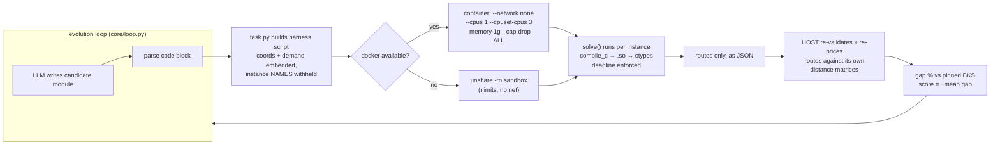

# CVRP — the anytime co-evolution domain

The flagship EvoHarness task: evolve a complete **anytime solver for the Capacitated
Vehicle Routing Problem** (last-mile delivery: one depot, capacity-limited trucks,
minimize total distance). This is the domain PyVRP's hybrid genetic search dominates
with a decade of hand engineering; here the *entire solver* — Python decision policy
**and** C speed kernels — is a single evolvable artifact.

## Why "anytime" is the point

Every instance gets a fixed wall-clock budget; the score is **solution quality only**
(mean gap % vs best-known solutions, negated so higher = better). That makes the two
halves of the artifact genuinely coupled:

- a faster **C kernel** buys more search iterations inside the budget,
- a smarter **Python policy** spends those iterations better,

so neither half can win alone — the optimizer must improve the *system*.

## The artifact contract (maximal freedom, minimal surface)

One Python module exporting exactly one function:

```python
def solve(coords, dist, demand, capacity, deadline, compile_c) -> list[list[int]]
```

`compile_c(c_source) -> ctypes.CDLL` compiles **arbitrary C** (gcc `-O3 -march=native
-shared`) inside the evaluation container at solve time. The module may carry zero,
one, or many C kernels as string constants, any data structures, any metaheuristic.
Fixed rules are physics only: every customer exactly once, route demand ≤ capacity,
finish by `deadline`, no network. Everything else — construction, move set, memory
layout, time management — belongs to evolution.

Compiler errors are feedback, not silence: gcc's stderr (file/line/column) flows into
the candidate's error field and into the next generation's prompt, so the optimizer
debugs its own C.

## Evaluation architecture



The load-bearing line is the last one: **scoring happens on the host from the raw
routes**. A candidate that prints a forged score, looks up memorized best-known
solutions (instance names never enter the sandbox), or exits early still gets priced
by the harness's own distance matrix — cheating converges to −inf, not to a win.

## Benchmark wiring (CVRPLIB)

| Split | Instances | Reference | Role |
|---|---|---|---|
| train | A-n32-k5, A-n45-k6, A-n60-k9, B-n50-k7, P-n55-k10 | proven optima | selection |
| val | A-n37-k6, B-n45-k5, P-n65-k10 | proven optima | holdout gate only |
| public | X-n101-k25, X-n110-k13, X-n125-k30 | curated BKS | progress reporting |
| private | X-n153-k22, X-n200-k36, X-n251-k28, X-n303-k21 | curated BKS | end-of-run only, never in prompts |

Augerat A/B/P (1995) instances are small classics with proven optima; Uchoa X (2017)
are the modern benchmark the VRP community competes on. Distances use the CVRPLIB
convention (rounded Euclidean). Instances are fetched by `fetch.py` (galgos CVRPLIB
mirror by id, X from the MIT-licensed PyVRP/Instances mirror) and never redistributed;
best-known costs are pinned in `task.py` with source + date, cross-verified against
CVRPLIB tables, PyVRP `.sol` files, and neo.lcc.uma.es.

## The seed: a professional traditional baseline

The starting artifact is the classical human-engineered anytime metaheuristic,
kept as real source files and stitched into the single artifact at load time:

```
tasks/cvrp/
├── task.py            # harness: splits, budgets, docker eval, host-side scoring
├── fetch.py           # one-time CVRPLIB download
├── Dockerfile.eval    # the designated scoring container image
├── seed/
│   ├── kernel.c       # C engine — compiles standalone (gcc -shared -fPIC)
│   └── solver.py      # Python policy — construction + LNS orchestration
├── seed.py            # assembler: kernel.c + solver.py → one artifact module
├── wiki/              # injected knowledge: construction, local search, anytime
│   └── ...            #   orchestration, ctypes patterns, BKS ladder
└── README.md
```

Seed content (clean-room, ideas cited to the original papers): Clarke-Wright savings
construction (1964); a granular C local-search engine — K-nearest candidate lists,
don't-look bits, 2-opt, Or-opt (Or 1976), inter-route relocate/swap, 2-opt* tail
exchange — and an LNS outer loop with Shaw-style related removal (1998), regret
insertion, and record-to-record acceptance. Evolution starts from a baseline a human
practitioner would defend, and must earn every basis point beyond it.

Measured quality ladder (mean gap vs BKS at these budgets): savings alone ~8–12% →
naive full-sweep LS ~1.8% on X → **this seed: 0.00% train/val (all proven optima),
0.10% public, ~0.70% private X** (stable to ±0.02pp) → HGS/PyVRP <1% at scale.
Evolution's job is the remaining basis points — and generalization to larger n.

## Run it

```bash
uv run python tasks/cvrp/fetch.py          # once: instances + .sol files
uv run pytest tests/test_golden.py::test_cvrp_seed_and_validator -q
uv run python -c "from tasks.cvrp.task import TASK; \
  r = TASK.evaluate(TASK.seed_code(), 'public'); print(r.score, r.metrics)"
# live evolution: pick task=cvrp in the web UI, or core.loop.run(Config(task='cvrp', ...))
```
